<p align="center">
  
</p>

<p align="center">
  <a href="https://kit.svelte.dev/"></a>
  <a href="https://www.typescriptlang.org/"></a>
  <a href="https://tailwindcss.com/"></a>
</p>

<p align="center">
  Every gambler thinks they're the exception. None of them are.
</p>

<p align="center">
  <a href="https://youlo.se"><strong>youlo.se</strong></a>
</p>

## About

An interactive proof that gambling is a losing proposition. No opinions, no moralizing. Just simulations, math, and the exposed mechanics behind every major game type.

Each section lets you play, then shows you what the math already knew. Roulette, slots, scratch tickets, crash, sports betting, lottery, and the Martingale strategy. All simulated with real odds, ghost players, and population-scale statistics.

## Quick Start

```bash
bun install
bun dev
bun run build
```

## License

All rights reserved. © 2026 Giorgio Brullo
